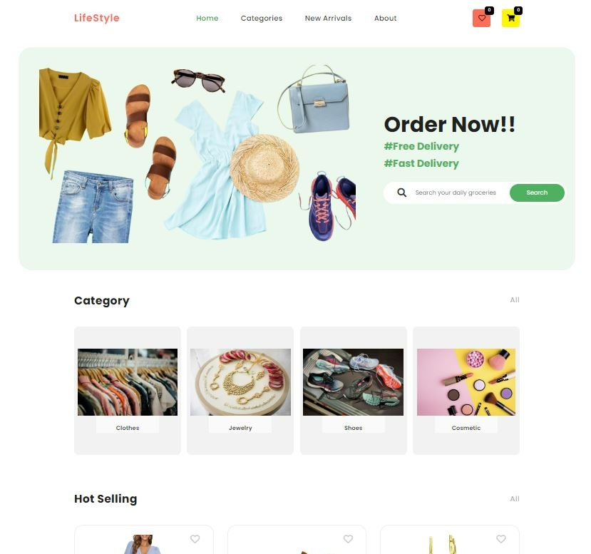
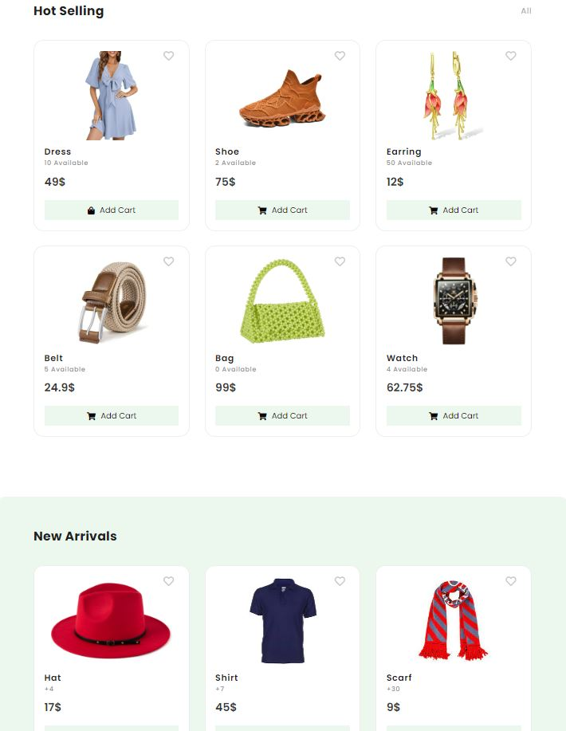
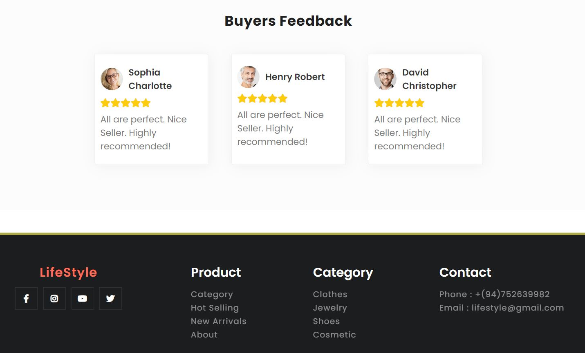
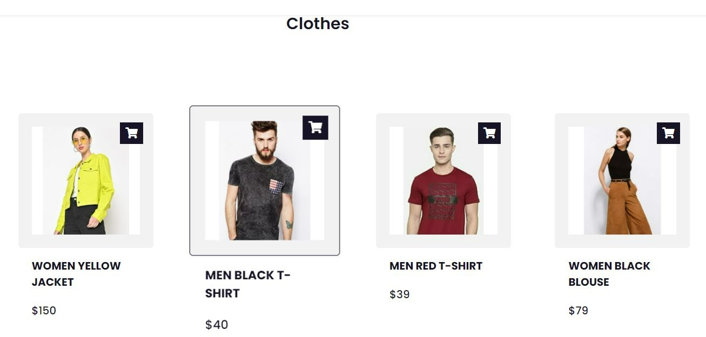
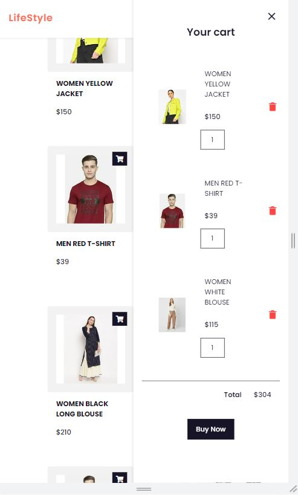
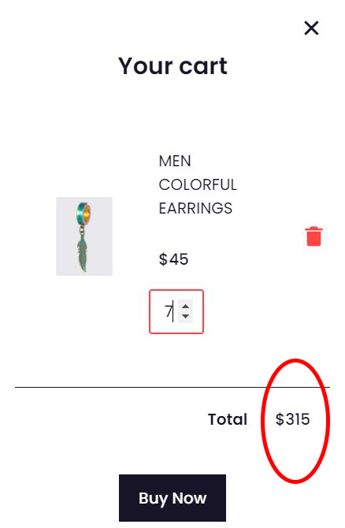
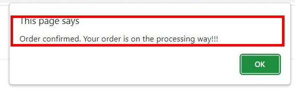
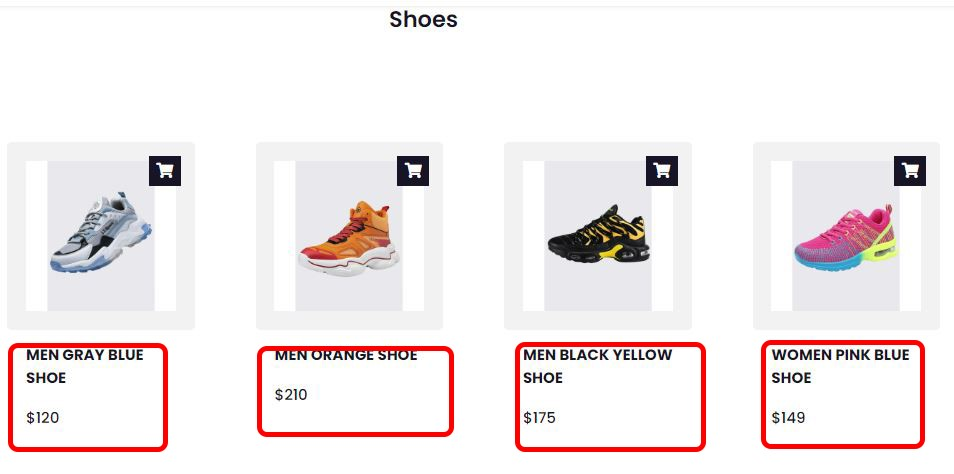

# LifeStyle(Shopping Web Application)

The LifeStyle E-Commerce project is a fully responsive online shopping platform built with HTML, CSS, and JavaScript. The platform allows users to explore various categories such as clothes, jewelry, and shoes. It includes essential e-commerce features like an interactive shopping cart, localStorage integration for cart persistence, quantity management, and an intuitive user interface. The website also includes customer feedback and a seamless checkout process.

## 5CS020 - Course Work

**Index**: 2064801  
**Name**: H.M.L.G.Herath  
**Project Title**: LifeStyle Shopping Web Website

## Features

- **Responsive Design**: Works seamlessly on desktop, tablet, and mobile devices.
- **Product Categories**: Separate sections for clothes, shoes, and jewelry.
- **Shopping Cart**: Users can add products to their cart, update quantities, and remove items.
- **Checkout**: Simple checkout process to confirm orders.
- **User Interaction**: Products can be liked and added to the cart using interactive buttons.

## Technologies Used

- HTML5, CSS3
- JavaScript (Local Storage for managing cart data)
- Responsive design with media queries and modern CSS practices

## Screenshot

## Future Improvements

- **User Authentication**: Implement user accounts where customers can sign in, manage their orders, and view their purchase history.
- **Checkout System**: Integrate a payment gateway (like Stripe or PayPal) to allow users to complete their purchases directly on the platform.
- **Product Filtering and Sorting**: Allow users to filter products based on price, popularity, or ratings and sort them for easier browsing.
- **Wishlist Feature**: Add the ability for users to save items to a wishlist, allowing them to purchase them at a later time.
- **Search Functionality**: Improve the current search box to provide real-time search suggestions and product results based on user input.
- **Product Reviews**: Allow users to leave reviews and ratings on products, helping other customers make informed decisions.
- **Push Notifications**: Notify users of new arrivals, promotions, or deals via browser notifications or emails.
